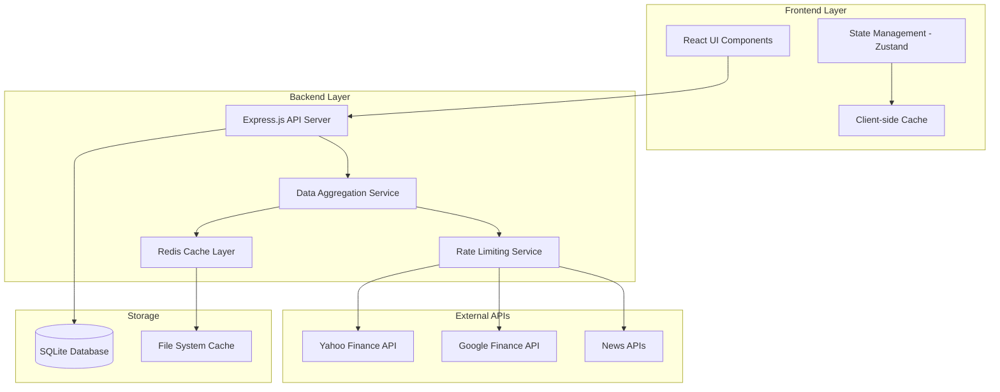

# Design Document

## Overview

MarketPulse is a modern, accessible financial dashboard platform built with a focus on performance, accessibility, and user experience. The system follows a modular architecture with aggressive caching, multi-source data aggregation, and responsive design principles. The platform supports both owner-configured default dashboards and user-created custom dashboards with real-time market data, news aggregation, and comprehensive accessibility features.

## TypeScript Guidelines

All code examples and implementations in this design document follow strict TypeScript guidelines:

- **Never use `any` type** - Always identify and use the correct specific type
- **Use `unknown` instead of `any`** - When the type is truly unknown, use `unknown` and add type guards
- **Explicit return types** - All functions must have explicit return types
- **Strict null checks** - Handle null and undefined cases explicitly
- **Generic constraints** - Use extends for type safety in generics
- **Type guards** - Implement proper type guards for runtime type checking

## Architecture

- [ ] ### High-Level Architecture



- [ ] ### Technology Stack

**Frontend:**

- React 18 with TypeScript
- Tailwind CSS for styling with custom design system
- Zustand for state management
- React Query for server state management
- Chart.js/Recharts for data visualization
- Framer Motion for animations

**Backend:**

- Node.js with Express.js
- TypeScript for type safety
- SQLite for local data storage
- Redis for caching (with fallback to memory cache)
- Node-cron for scheduled tasks

**Development & Build:**

- Vite for fast development and building
- ESLint + Prettier for code quality
- Vitest for unit testing
- Playwright for E2E testing

## Components and Interfaces

- [ ] ### Frontend Components

- [ ] #### Core Layout Components

```typescript
// Layout Components
interface AppLayoutProps {
  children: React.ReactNode;
  theme: 'light' | 'dark';
}

interface NavigationProps {
  dashboards: Dashboard[];
  activeDashboard: string;
  onDashboardChange: (id: string) => void;
}

interface HeaderProps {
  user?: User;
  onThemeToggle: () => void;
  onRefresh: () => void;
}
```

- [ ] #### Dashboard Components

```typescript
interface DashboardProps {
  dashboard: Dashboard;
  isEditable: boolean;
  onUpdate: (dashboard: Dashboard) => void;
}

interface WidgetContainerProps {
  widgets: Widget[];
  layout: LayoutConfig;
  onLayoutChange: (layout: LayoutConfig) => void;
}

interface AssetWidgetProps {
  assets: Asset[];
  displayMode: 'list' | 'grid' | 'chart';
  refreshInterval: number;
}
```

- [ ] #### Data Visualization Components

```typescript
interface ChartWidgetProps {
  asset: Asset;
  timeframe: '1D' | '1W' | '1M' | '3M' | '1Y';
  indicators: TechnicalIndicator[];
  height: number;
}

interface DataTableProps {
  data: Asset[];
  columns: TableColumn[];
  sortable: boolean;
  filterable: boolean;
}
```

- [ ] ### Backend API Interfaces

- [ ] #### Data Aggregation Service

```typescript
interface DataAggregationService {
  getAssetData(symbols: string[]): Promise<Asset[]>;
  getHistoricalData(symbol: string, timeframe: string): Promise<HistoricalData>;
  getNewsData(symbols?: string[]): Promise<NewsArticle[]>;
  refreshCache(symbols?: string[]): Promise<void>;
}

interface CacheService {
  get<T>(key: string): Promise<T | null>;
  set<T>(key: string, value: T, ttl?: number): Promise<void>;
  invalidate(pattern: string): Promise<void>;
  getStats(): Promise<CacheStats>;
}
```

- [ ] #### API Endpoints

```typescript
// REST API Endpoints
GET /api/dashboards - Get user dashboards
POST /api/dashboards - Create new dashboard
PUT /api/dashboards/:id - Update dashboard
DELETE /api/dashboards/:id - Delete dashboard

GET /api/assets/:symbols - Get asset data
GET /api/assets/:symbol/history - Get historical data
GET /api/news - Get market news
POST /api/cache/refresh - Refresh cache

GET /api/system/health - System health check
GET /api/system/cache-stats - Cache statistics
```

## Data Models

- [ ] ### Core Data Models

```typescript
interface User {
  id: string;
  email: string;
  preferences: UserPreferences;
  createdAt: Date;
  updatedAt: Date;
}

interface UserPreferences {
  theme: 'light' | 'dark' | 'system';
  defaultDashboard?: string;
  refreshInterval: number;
  notifications: NotificationSettings;
}

interface Dashboard {
  id: string;
  name: string;
  description?: string;
  isDefault: boolean;
  isPublic: boolean;
  ownerId: string;
  widgets: Widget[];
  layout: LayoutConfig;
  createdAt: Date;
  updatedAt: Date;
}

interface Widget {
  id: string;
  type: 'asset-list' | 'chart' | 'news' | 'market-summary';
  title: string;
  config: WidgetConfig;
  position: WidgetPosition;
}

interface Asset {
  symbol: string;
  name: string;
  price: number;
  change: number;
  changePercent: number;
  volume: number;
  marketCap?: number;
  lastUpdated: Date;
  source: DataSource;
}

interface NewsArticle {
  id: string;
  title: string;
  summary: string;
  url: string;
  publishedAt: Date;
  source: string;
  relatedAssets: string[];
  sentiment?: 'positive' | 'negative' | 'neutral';
}
```

- [ ] ### Configuration Models

```typescript
interface DataSourceConfig {
  name: string;
  apiKeys: string[];
  rateLimit: {
    requestsPerMinute: number;
    requestsPerHour: number;
  };
  endpoints: {
    assets: string;
    historical: string;
    news: string;
  };
  cacheTTL: {
    assets: number;
    historical: number;
    news: number;
  };
}

interface CacheConfig {
  defaultTTL: number;
  maxSize: number;
  cleanupInterval: number;
  persistToDisk: boolean;
}
```

## Error Handling

- [ ] ### Frontend Error Handling

```typescript
interface ErrorBoundaryState {
  hasError: boolean;
  error?: Error;
  errorInfo?: ErrorInfo;
}

interface ApiErrorResponse {
  error: string;
  message: string;
  statusCode: number;
  timestamp: string;
}

// Error handling strategies:
// 1. Component-level error boundaries for widget failures
// 2. Global error boundary for application-level errors
// 3. Toast notifications for user-actionable errors
// 4. Retry mechanisms for network failures
// 5. Graceful degradation for missing data
```

- [ ] ### Backend Error Handling

```typescript
interface ErrorHandler {
  handleApiError(error: Error, req: Request, res: Response): void;
  handleCacheError(error: Error): void;
  handleDataSourceError(error: Error, source: string): void;
}

// Error handling patterns:
// 1. Structured error responses with consistent format
// 2. Automatic retry with exponential backoff for external APIs
// 3. Circuit breaker pattern for failing data sources
// 4. Comprehensive logging with error tracking
// 5. Fallback data sources when primary sources fail
```

## Testing Strategy

- [ ] ### Systematic Testing Framework

The application follows a comprehensive testing approach using `test-results.md` for progress tracking:

- **11 test categories** covering all aspects from structure to production
- **Issue-driven development** with systematic problem resolution
- **Zero-error policy** ensuring no test is marked complete until fully passing
- **Step-by-step validation** with progress documentation

- [ ] ### Frontend Testing

```typescript
// Unit Tests - Vitest
describe('AssetWidget', () => {
  it('should display asset data correctly');
  it('should handle loading states');
  it('should handle error states');
  it('should be accessible via keyboard navigation');
});

// Integration Tests - React Testing Library
describe('Dashboard Integration', () => {
  it('should load and display dashboard data');
  it('should handle real-time updates');
  it('should persist user changes');
});

// E2E Tests - Playwright
describe('User Workflows', () => {
  it('should create and customize dashboard');
  it('should switch between light and dark themes');
  it('should work on mobile devices');
});
```

- [ ] ### Backend Testing

```typescript
// Unit Tests
describe('DataAggregationService', () => {
  it('should aggregate data from multiple sources');
  it('should handle API failures gracefully');
  it('should respect rate limits');
});

// Integration Tests
describe('API Endpoints', () => {
  it('should return dashboard data');
  it('should handle cache refresh');
  it('should validate request parameters');
});

// Performance Tests
describe('Performance', () => {
  it('should handle 100 concurrent requests');
  it('should respond within 200ms for cached data');
  it('should not exceed memory limits');
});
```

- [ ] ### Accessibility Testing

```typescript
// Automated Accessibility Tests
describe('Accessibility', () => {
  it('should meet WCAG AA standards');
  it('should support keyboard navigation');
  it('should provide screen reader announcements');
  it('should maintain focus management');
  it('should have sufficient color contrast');
});
```

- [ ] ### Testing Validation Process

1. **test-results.md tracking** - All testing progress documented
2. **Sequential execution** - Tests run in systematic order
3. **Issue documentation** - All problems logged with fixes
4. **Regression testing** - Existing functionality validated
5. **Completion criteria** - Zero errors before marking tests done
6. **Quality gates** - No advancement until all tests pass

## Performance Considerations

- [ ] ### Caching Strategy

1. **Multi-level Caching:**
   - Browser cache for static assets
   - Client-side cache for API responses
   - Server-side Redis cache for external API data
   - File system cache for persistence

2. **Cache Invalidation:**
   - Time-based expiration (TTL)
   - Manual refresh triggers
   - Smart invalidation based on data freshness

3. **Rate Limiting:**
   - Multiple API keys per source with automatic rotation
   - Exponential backoff on rate limit hits
   - Circuit breaker pattern for failing sources

- [ ] ### Optimization Techniques

1. **Frontend Optimizations:**
   - Code splitting and lazy loading
   - Virtual scrolling for large data sets
   - Debounced user inputs
   - Optimized re-renders with React.memo

2. **Backend Optimizations:**
   - Connection pooling for database
   - Batch API requests where possible
   - Compression for API responses
   - Efficient data serialization

3. **Real-time Updates:**
   - WebSocket connections for live data
   - Selective updates to minimize re-renders
   - Optimistic updates for better UX

## Security Considerations

1. **API Security:**
   - API key rotation and secure storage
   - Rate limiting per user/IP
   - Input validation and sanitization
   - CORS configuration

2. **Data Protection:**
   - No sensitive user data storage
   - Secure session management
   - HTTPS enforcement
   - Content Security Policy headers

3. **Client Security:**
   - XSS protection
   - Secure cookie settings
   - Environment variable protection
   - Dependency vulnerability scanning
