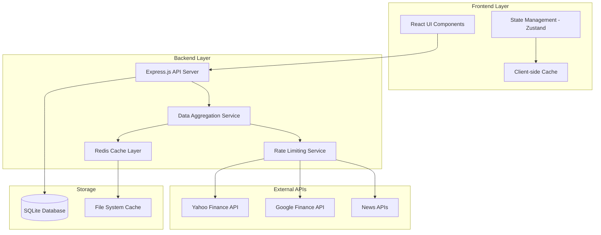

# Design Document

## Overview

MarketPulse is a modern, accessible financial dashboard platform built with a focus on performance, accessibility, and user experience. The system follows a modular architecture with aggressive caching, multi-source data aggregation, and responsive design principles. The platform supports both owner-configured default dashboards and user-created custom dashboards with real-time market data, news aggregation, and comprehensive accessibility features.

## TypeScript Guidelines

All code examples and implementations in this design document follow strict TypeScript guidelines:

- **Never use `any` type** - Always identify and use the correct specific type
- **Use `unknown` instead of `any`** - When the type is truly unknown, use `unknown` and add type guards
- **Explicit return types** - All functions must have explicit return types
- **Strict null checks** - Handle null and undefined cases explicitly
- **Generic constraints** - Use extends for type safety in generics
- **Type guards** - Implement proper type guards for runtime type checking

## Architecture

- - [ ] ### High-Level Architecture



- - [ ] ### Technology Stack

**Frontend:**

- React 18 with TypeScript
- Tailwind CSS for styling with custom design system
- Zustand for state management
- React Query for server state management
- Chart.js/Recharts for data visualization
- Framer Motion for animations

**Backend:**

- Node.js with Express.js
- TypeScript for type safety
- SQLite for local data storage
- Redis for caching (with fallback to memory cache)
- Node-cron for scheduled tasks

**Development & Build:**

- Vite for fast development and building
- ESLint + Prettier for code quality
- Vitest for unit testing
- Playwright for E2E testing

## Components and Interfaces

- - [ ] ### Frontend Components

- - [ ] #### Core Layout Components

```typescript
// Layout Components
interface AppLayoutProps {
  children: React.ReactNode;
  theme: 'light' | 'dark';
}

interface NavigationProps {
  dashboards: Dashboard[];
  activeDashboard: string;
  onDashboardChange: (id: string) => void;
}

interface HeaderProps {
  user?: User;
  onThemeToggle: () => void;
  onRefresh: () => void;
}
```

- - [ ] #### Dashboard Components

```typescript
interface DashboardProps {
  dashboard: Dashboard;
  isEditable: boolean;
  onUpdate: (dashboard: Dashboard) => void;
}

interface WidgetContainerProps {
  widgets: Widget[];
  layout: LayoutConfig;
  onLayoutChange: (layout: LayoutConfig) => void;
}

interface AssetWidgetProps {
  assets: Asset[];
  displayMode: 'list' | 'grid' | 'chart';
  refreshInterval: number;
}
```

- - [ ] #### Data Visualization Components

```typescript
interface ChartWidgetProps {
  asset: Asset;
  timeframe: '1D' | '1W' | '1M' | '3M' | '1Y';
  indicators: TechnicalIndicator[];
  height: number;
  chartTypes: ('line' | 'candlestick' | 'bar')[]; // Configurable chart types
  responsive: boolean; // Responsive layout support
}

interface DataTableProps {
  data: Asset[];
  columns: TableColumn[];
  sortable: boolean; // Sortable tables requirement
  filterable: boolean; // Data filtering requirement
  virtualScrolling: boolean; // Performance optimization for large datasets
  touchOptimized: boolean; // Mobile optimization
}

interface WidgetContainerProps {
  widgets: Widget[];
  layout: LayoutConfig;
  onLayoutChange: (layout: LayoutConfig) => void;
  dragAndDrop?: boolean; // Optional drag-and-drop functionality
  responsive: boolean; // Multi-device support
}

interface LoadingStateProps {
  type: 'skeleton' | 'spinner' | 'progress';
  preventLayoutShift: boolean; // Prevent layout shifts during loading
  message?: string;
}

interface ErrorStateProps {
  error: string;
  icon: string;
  color: 'error' | 'warning' | 'info';
  retryAction?: () => void;
  recoveryOptions?: string[];
}
```

- - [ ] ### Backend API Interfaces

- - [ ] #### Data Aggregation Service

```typescript
interface DataAggregationService {
  getAssetData(symbols: string[]): Promise<Asset[]>;
  getHistoricalData(symbol: string, timeframe: string): Promise<HistoricalData>;
  getNewsData(symbols?: string[]): Promise<NewsArticle[]>;
  refreshCache(symbols?: string[]): Promise<void>;
}

interface CacheService {
  get<T>(key: string): Promise<T | null>;
  set<T>(key: string, value: T, ttl?: number): Promise<void>;
  invalidate(pattern: string): Promise<void>;
  getStats(): Promise<CacheStats>;
}
```

- - [ ] #### API Endpoints

```typescript
// REST API Endpoints
GET /api/dashboards - Get user dashboards (including owner-configured defaults)
POST /api/dashboards - Create new custom dashboard
PUT /api/dashboards/:id - Update dashboard configuration
DELETE /api/dashboards/:id - Delete custom dashboard
GET /api/dashboards/defaults - Get system owner-configured default dashboards

GET /api/assets/:symbols - Get real-time asset data with market sentiment
GET /api/assets/:symbol/history - Get historical data with technical indicators
GET /api/assets/search - Search and filter assets
GET /api/news - Get market news with asset tagging
GET /api/news/:symbol - Get asset-specific news
POST /api/cache/refresh - Manual cache refresh trigger
POST /api/cache/invalidate - Ad-hoc cache invalidation

GET /api/system/health - System health check
GET /api/system/cache-stats - Cache statistics and performance metrics
GET /api/system/performance - Performance monitoring dashboard
GET /api/system/errors - Error tracking and logging

// WebSocket Endpoints
WS /ws/market-data - Real-time price updates
WS /ws/news - Real-time news updates
WS /ws/system - System status updates
```

## Data Models

- - [ ] ### Core Data Models

```typescript
interface User {
  id: string;
  email: string;
  preferences: UserPreferences;
  createdAt: Date;
  updatedAt: Date;
}

interface UserPreferences {
  theme: 'light' | 'dark' | 'system';
  defaultDashboard?: string;
  refreshInterval: number;
  notifications: NotificationSettings;
}

interface Dashboard {
  id: string;
  name: string;
  description?: string;
  isDefault: boolean; // Owner-configured system dashboards
  isPublic: boolean;
  ownerId: string;
  widgets: Widget[];
  layout: LayoutConfig;
  createdAt: Date;
  updatedAt: Date;
}

interface Widget {
  id: string;
  type: 'asset-list' | 'chart' | 'news' | 'market-summary';
  title: string;
  config: WidgetConfig;
  position: WidgetPosition;
  sortable: boolean; // For sortable tables requirement
  filterable: boolean; // For data filtering requirement
}

interface Asset {
  symbol: string;
  name: string;
  price: number;
  change: number;
  changePercent: number;
  volume: number;
  marketCap?: number;
  marketSentiment?: 'positive' | 'negative' | 'neutral'; // Market sentiment requirement
  ancillaryMetrics: Record<string, unknown>; // Additional financial metrics
  lastUpdated: Date;
  source: DataSource;
}

interface NewsArticle {
  id: string;
  title: string;
  summary: string;
  url: string;
  publishedAt: Date;
  source: string;
  relatedAssets: string[]; // Tagged with relevant asset symbols
  sentiment?: 'positive' | 'negative' | 'neutral';
  fullContent?: string; // Access to full article content
}

interface SystemState {
  loading: boolean;
  error: string | null;
  success: boolean;
  lastUpdated: Date;
}

interface PerformanceMetrics {
  responseTime: number;
  cacheHitRatio: number;
  memoryUsage: number;
  concurrentRequests: number;
}
```

- - [ ] ### Configuration Models

```typescript
interface DataSourceConfig {
  name: string;
  apiKeys: string[]; // Multiple API keys for automatic rotation
  rateLimit: {
    requestsPerMinute: number;
    requestsPerHour: number;
  };
  endpoints: {
    assets: string;
    historical: string;
    news: string;
  };
  cacheTTL: {
    assets: number; // Minimum 1 minute, configurable
    historical: number;
    news: number; // Refresh at least every 15 minutes
  };
  fallbackSources: string[]; // Alternative data sources for graceful degradation
}

interface CacheConfig {
  defaultTTL: number;
  maxSize: number;
  cleanupInterval: number;
  persistToDisk: boolean;
  aggressiveCaching: boolean; // To avoid API throttling
  autoExtendOnRateLimit: boolean; // Extend cache duration on rate limits
}

interface AccessibilityConfig {
  wcagLevel: 'AA' | 'AAA';
  highContrast: boolean;
  screenReaderSupport: boolean;
  keyboardNavigation: boolean;
  focusManagement: boolean;
}

interface ResponsiveConfig {
  breakpoints: {
    mobile: number; // 640px
    tablet: number; // 768px
    desktop: number; // 1024px
    ultraWide: number; // 1440px+
  };
  touchOptimized: boolean;
  performanceOptimized: boolean;
}
```

## Error Handling

- - [ ] ### Frontend Error Handling

```typescript
interface ErrorBoundaryState {
  hasError: boolean;
  error?: Error;
  errorInfo?: ErrorInfo;
}

interface ApiErrorResponse {
  error: string;
  message: string;
  statusCode: number;
  timestamp: string;
}

interface SystemStateIndicators {
  loading: boolean;
  error: string | null;
  success: boolean;
  retryCount: number;
}

// Error handling strategies:
// 1. Component-level error boundaries for widget failures
// 2. Global error boundary for application-level errors
// 3. Toast notifications for user-actionable errors with appropriate icons and colors
// 4. Retry mechanisms for network failures with exponential backoff
// 5. Graceful degradation for missing data with fallback content
// 6. Clear visual feedback for loading, error, and success states
// 7. Consistent styling and iconography across all message types
// 8. Visually appealing loading indicators that prevent layout shifts
```

- - [ ] ### Backend Error Handling

```typescript
interface ErrorHandler {
  handleApiError(error: Error, req: Request, res: Response): void;
  handleCacheError(error: Error): void;
  handleDataSourceError(error: Error, source: string): void;
  handleNetworkConnectivity(error: Error): void;
  handleDatabaseFailure(error: Error): void;
}

interface RecoveryMechanisms {
  gracefulDegradation: boolean;
  alternativeDataSources: string[];
  retryStrategies: RetryConfig[];
  fallbackCaching: CacheConfig;
}

// Error handling patterns:
// 1. Structured error responses with consistent format and user-friendly messages
// 2. Automatic retry with exponential backoff for external APIs
// 3. Circuit breaker pattern for failing data sources with automatic recovery
// 4. Comprehensive logging with error tracking and monitoring
// 5. Fallback data sources when primary sources fail (Google Finance when Yahoo fails)
// 6. Graceful degradation when external APIs fail with alternative data sources
// 7. Network connectivity loss handling with appropriate user messaging and retry mechanisms
// 8. Cache system failure fallback to alternative caching strategies
// 9. Database operation failure handling with user-friendly error messages
// 10. Robust error handling and recovery mechanisms for application stability
```

## Testing Strategy

- - [ ] ### Systematic Testing Framework

The application follows a comprehensive testing approach using `test-results.md` for progress tracking:

- **11 test categories** covering all aspects from structure to production
- **Issue-driven development** with systematic problem resolution
- **Zero-error policy** ensuring no test is marked complete until fully passing
- **Step-by-step validation** with progress documentation
- **Regression testing** to ensure existing functionality continues working after changes

- - [ ] ### Frontend Testing

```typescript
// Unit Tests - Vitest
describe('AssetWidget', () => {
  it('should display asset data correctly');
  it('should handle loading states');
  it('should handle error states');
  it('should be accessible via keyboard navigation');
  it('should maintain single responsibility principle');
});

// Integration Tests - React Testing Library
describe('Dashboard Integration', () => {
  it('should load and display dashboard data');
  it('should handle real-time updates');
  it('should persist user changes');
  it('should validate existing functionality after changes');
});

// E2E Tests - Playwright
describe('User Workflows', () => {
  it('should create and customize dashboard');
  it('should switch between light and dark themes');
  it('should work on mobile devices');
  it('should maintain performance under load');
});
```

- - [ ] ### Backend Testing

```typescript
// Unit Tests
describe('DataAggregationService', () => {
  it('should aggregate data from multiple sources');
  it('should handle API failures gracefully');
  it('should respect rate limits');
  it('should maintain response times under 200ms for cached data');
});

// Integration Tests
describe('API Endpoints', () => {
  it('should return dashboard data');
  it('should handle cache refresh');
  it('should validate request parameters');
  it('should handle concurrent requests efficiently');
});

// Performance Tests
describe('Performance', () => {
  it('should handle 100 concurrent requests');
  it('should respond within 200ms for cached data');
  it('should not exceed memory limits');
  it('should implement cleanup and optimization routines');
});
```

- - [ ] ### Accessibility Testing

```typescript
// Automated Accessibility Tests
describe('Accessibility', () => {
  it('should meet WCAG AA standards');
  it('should support keyboard navigation');
  it('should provide screen reader announcements');
  it('should maintain focus management');
  it('should have sufficient color contrast');
  it('should work with high contrast mode');
});
```

- - [ ] ### Testing Validation Process

1. **test-results.md tracking** - All testing progress documented with comprehensive issue tracking
2. **Sequential execution** - Tests run in systematic order with 11 comprehensive categories
3. **Issue documentation** - All problems logged with specific details and resolution steps
4. **Regression testing** - Existing functionality validated after every change
5. **Completion criteria** - Zero errors before marking tests done, systematic problem resolution
6. **Quality gates** - No advancement until all tests pass and issues are resolved
7. **Performance validation** - Response times, memory usage, and concurrent request handling
8. **Code quality assurance** - Single responsibility principle and modular architecture validation

## Performance Considerations

- - [ ] ### Caching Strategy

1. **Multi-level Caching:**
   - Browser cache for static assets
   - Client-side cache for API responses
   - Server-side Redis cache for external API data
   - File system cache for persistence
   - Configurable cache duration (minimum 1 minute) with automatic extension on rate limit approach

2. **Cache Invalidation:**
   - Time-based expiration (TTL) with configurable durations
   - Manual refresh triggers and ad-hoc cache invalidation
   - Smart invalidation based on data freshness
   - Background refresh mechanisms for seamless user experience

3. **Rate Limiting:**
   - Multiple API keys per source with automatic rotation
   - Exponential backoff on rate limit hits
   - Circuit breaker pattern for failing sources
   - Aggressive caching to avoid API throttling and protect API keys

- - [ ] ### Optimization Techniques

1. **Frontend Optimizations:**
   - Code splitting and lazy loading for improved initial load times
   - Virtual scrolling for large data sets
   - Debounced user inputs to reduce unnecessary API calls
   - Optimized re-renders with React.memo and selective updates
   - Virtualization and lazy loading techniques for large datasets

2. **Backend Optimizations:**
   - Connection pooling for database operations
   - Batch API requests where possible to minimize external calls
   - Compression for API responses to reduce bandwidth
   - Efficient data serialization and response formatting
   - Response times maintained under 200ms for cached data
   - Memory usage monitoring with cleanup and optimization routines

3. **Real-time Updates:**
   - WebSocket connections for live data streaming
   - Selective updates to minimize re-renders and layout shifts
   - Optimistic updates for better user experience
   - Efficient data synchronization across components

4. **Performance Monitoring:**
   - Concurrent request handling (100+ simultaneous requests)
   - Memory usage thresholds with automatic cleanup
   - Response time tracking and optimization
   - Performance metrics dashboard for system monitoring

## Security Considerations

1. **API Security:**
   - API key rotation and secure storage with multiple keys per source
   - Rate limiting per user/IP with automatic key rotation on 429 responses
   - Input validation and sanitization for all user inputs
   - CORS configuration for secure cross-origin requests

2. **Data Protection:**
   - No sensitive user data storage beyond preferences
   - Secure session management with proper authentication
   - HTTPS enforcement in production environments
   - Content Security Policy headers for XSS protection

3. **Client Security:**
   - XSS protection with input sanitization
   - Secure cookie settings and session management
   - Environment variable protection for API keys
   - Dependency vulnerability scanning and updates

4. **System Resilience:**
   - Circuit breaker patterns for external API failures
   - Graceful degradation when services are unavailable
   - Comprehensive error logging without exposing sensitive information
   - Fallback mechanisms for critical functionality

## Code Quality and Maintainability

- - [ ] ### Modular Architecture

1. **Single Responsibility Principle:**
   - Each file and component has one conceptual responsibility
   - Large files broken down into smaller, manageable modules
   - Duplicate code consolidated into reusable components
   - Unused code removed to maintain clean codebase

2. **Code Enhancement Policy:**
   - Enhance existing files instead of creating alternative versions
   - No `enhanced*`, `*v2`, `improved*` files allowed
   - Modify original files to maintain single source of truth
   - Maintain backward compatibility during enhancements

3. **Quality Assurance:**
   - Comprehensive validation that existing functionality isn't broken
   - Regression tests for all new features and changes
   - UI behavior and interactions remain unchanged during refactoring
   - API changes maintain backward compatibility and data integrity

- - [ ] ### Development Standards

1. **TypeScript Guidelines:**
   - Never use `any` type - always identify correct specific types
   - Use `unknown` instead of `any` with proper type guards
   - Explicit return types for all public functions
   - Strict null checks with explicit handling
   - Generic constraints using extends for type safety

2. **Testing Requirements:**
   - Systematic testing with 11 comprehensive test categories
   - Issue tracking in test-results.md with detailed resolution steps
   - Zero-error completion policy - no tests marked done until fully passing
   - Regression testing to verify existing functionality continues working
