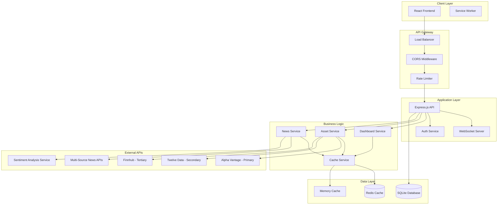
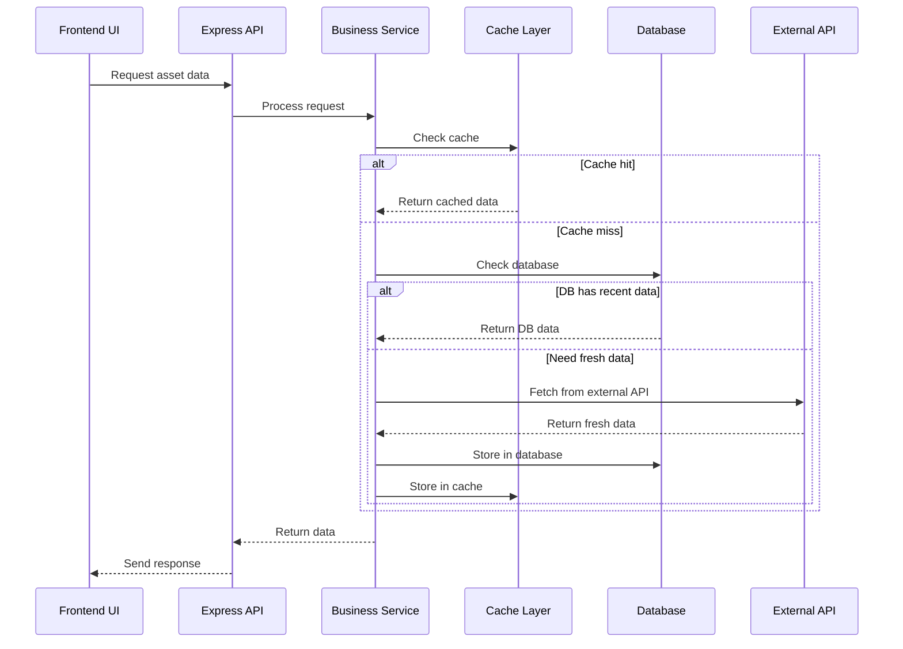
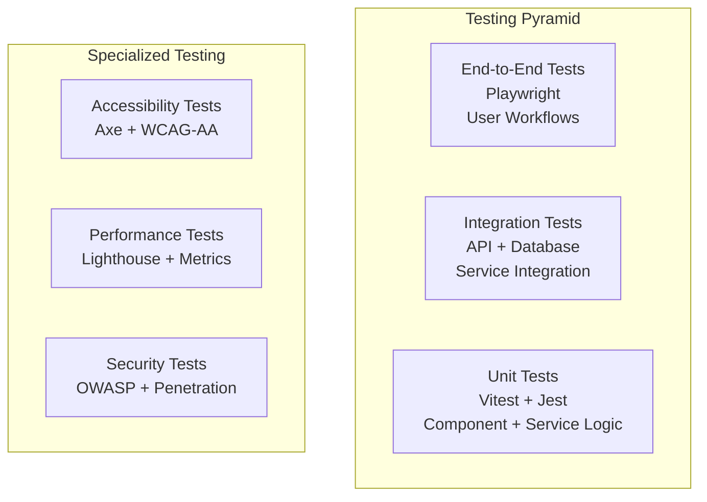

# Design Document

## Overview

MarketPulse is designed as a modular, scalable financial dashboard platform that supports slice-by-slice implementation. The architecture emphasizes clear separation of concerns, well-defined interfaces, and incremental feature development while maintaining strict quality standards and zero-error policy enforcement.

The system follows a modern web application architecture with a React-based frontend, Express.js backend, and multi-level caching strategy. The design prioritizes performance, accessibility, real-time capabilities, and comprehensive security measures while ensuring each implementation slice can be developed and deployed independently.

**Key Design Principles:**

- **Owner-Configured Defaults**: Platform owners can configure default dashboard layouts that are automatically provisioned to new users
- **Multi-Source Data Aggregation**: Primary Alpha Vantage API with automatic Twelve Data and Finnhub failover and API key rotation
- **Aggressive Caching Strategy**: Redis primary cache with memory fallback and 30-second TTL for market data
- **Real-time WebSocket Updates**: Sub-second market data updates with automatic reconnection and graceful degradation
- **WCAG-AA Accessibility**: Full compliance with accessibility standards across all features
- **Zero-Error Quality Gates**: Comprehensive testing and validation before each git commit

## Architecture

### High-Level Architecture



### Slice-by-Slice Architecture Design

The architecture is designed to support incremental development where each slice adds complete end-to-end functionality:

**Slice Independence:**

- Each feature slice has its own database tables, API endpoints, and UI components
- Shared infrastructure (auth, caching, logging, monitoring) is established in POC
- New slices extend existing patterns without modifying core functionality
- Owner-configured default dashboards are provisioned automatically to new users

**Interface Contracts:**

- Well-defined TypeScript interfaces between layers with explicit return types
- API contracts using Zod schemas for validation and security
- Database schema migrations for incremental changes
- Comprehensive error handling with proper HTTP status codes

**Quality Gate Integration:**

- Zero-error policy enforced at every slice completion
- Comprehensive testing (unit, integration, E2E, accessibility, performance)
- TypeScript strict mode with no implicit any types
- ESLint validation with zero warnings tolerance
- 80% minimum test coverage across all code paths

## Components and Interfaces

### Frontend Architecture

#### Component Hierarchy

```
src/
├── components/
│   ├── ui/                    # Base UI components (WCAG-AA compliant)
│   │   ├── Button.tsx         # Keyboard accessible with ARIA labels
│   │   ├── Input.tsx          # Form validation with error messages
│   │   ├── Modal.tsx          # Focus management and escape handling
│   │   ├── Card.tsx           # Semantic structure with proper headings
│   │   ├── LoadingSpinner.tsx # Screen reader announcements
│   │   └── ErrorBoundary.tsx  # Graceful error handling
│   ├── layout/                # Responsive layout components
│   │   ├── Header.tsx         # Navigation with skip links
│   │   ├── Navigation.tsx     # Keyboard navigation support
│   │   ├── Sidebar.tsx        # Collapsible with touch gestures
│   │   └── Footer.tsx         # Accessible footer links
│   ├── widgets/               # Dashboard widgets with real-time updates
│   │   ├── AssetWidget.tsx    # Live price updates via WebSocket
│   │   ├── NewsWidget.tsx     # Sentiment analysis display
│   │   ├── ChartWidget.tsx    # Interactive charts with Chart.js
│   │   └── SummaryWidget.tsx  # Portfolio summary calculations
│   ├── forms/                 # Validated form components
│   │   ├── LoginForm.tsx      # JWT authentication
│   │   ├── RegisterForm.tsx   # User registration with validation
│   │   └── DashboardForm.tsx  # Dashboard configuration
│   ├── dashboard/             # Dashboard management
│   │   ├── DashboardGrid.tsx  # Drag-and-drop with grid snapping
│   │   ├── WidgetContainer.tsx # Widget positioning and resizing
│   │   ├── DashboardTabs.tsx  # Multiple dashboard navigation
│   │   └── DefaultDashboardManager.tsx # Owner configuration interface
│   └── admin/                 # Platform owner components
│       ├── DefaultDashboardConfig.tsx
│       ├── UserManagement.tsx
│       └── SystemMonitoring.tsx
├── hooks/                     # Custom React hooks
│   ├── useMarketData.ts       # Market data with caching and failover
│   ├── useWebSocket.ts        # Real-time updates with reconnection
│   ├── useAuth.ts             # JWT authentication and session management
│   ├── useDashboard.ts        # Dashboard CRUD operations
│   ├── useLocalStorage.ts     # Persistent user preferences
│   ├── useAccessibility.ts    # WCAG-AA compliance helpers
│   ├── usePerformance.ts      # Performance monitoring and optimization
│   └── useTheme.ts            # Dark/light theme with smooth transitions
├── services/                  # API services with error handling
│   ├── api.ts                 # Base API client with rate limiting
│   ├── marketDataService.ts   # Yahoo Finance + Google Finance failover
│   ├── dashboardService.ts    # Dashboard CRUD with owner defaults
│   ├── newsService.ts         # Multi-source news with sentiment analysis
│   ├── authService.ts         # JWT authentication and session management
│   ├── cacheService.ts        # Multi-level caching strategy
│   └── monitoringService.ts   # System health and performance metrics
├── stores/                    # Zustand state management
│   ├── authStore.ts           # User authentication state
│   ├── themeStore.ts          # Dark/light theme preferences
│   ├── dashboardStore.ts      # Dashboard configurations and layouts
│   ├── notificationStore.ts   # Toast notifications and alerts
│   ├── websocketStore.ts      # WebSocket connection status
│   └── performanceStore.ts    # Performance metrics and monitoring
├── types/                     # TypeScript type definitions (strict mode)
│   ├── api.ts                 # API response interfaces with Zod schemas
│   ├── dashboard.ts           # Dashboard and widget configuration types
│   ├── asset.ts               # Market data and asset information types
│   ├── news.ts                # News articles and sentiment analysis types
│   ├── user.ts                # User authentication and preferences types
│   ├── websocket.ts           # WebSocket message and event types
│   └── monitoring.ts          # System health and performance types
└── utils/                     # Utility functions
    ├── formatters.ts          # Currency, date, and number formatting
    ├── validators.ts          # Zod schema validation utilities
    ├── constants.ts           # Application constants and configuration
    ├── helpers.ts             # General utility functions
    ├── accessibility.ts       # WCAG-AA compliance utilities
    ├── performance.ts         # Performance monitoring and optimization
    └── security.ts            # Security utilities and sanitization
```

#### Key Frontend Interfaces

```typescript
// Core API Response Interface
interface ApiResponse<T> {
  data: T;
  success: boolean;
  error?: string;
  timestamp: number;
  metadata?: {
    page?: number;
    limit?: number;
    total?: number;
  };
}

// Asset Data Interface
interface Asset {
  symbol: string;
  name: string;
  price: number;
  change: number;
  changePercent: number;
  volume: number;
  marketCap: number;
  lastUpdated: string;
}

// Dashboard Configuration Interface
interface Dashboard {
  id: string;
  name: string;
  description?: string;
  isDefault: boolean;
  layout: DashboardLayout;
  widgets: Widget[];
  createdAt: string;
  updatedAt: string;
}

// Widget Configuration Interface
interface Widget {
  id: string;
  type: 'asset' | 'news' | 'chart' | 'summary';
  position: { x: number; y: number; w: number; h: number };
  config: WidgetConfig;
}

// WebSocket Message Interface
interface WebSocketMessage {
  type: 'price_update' | 'news_update' | 'system_status' | 'connection_status';
  payload: any;
  timestamp: number;
  userId?: string;
}

// User Preferences Interface
interface UserPreferences {
  theme: 'light' | 'dark';
  refreshInterval: number;
  notifications: {
    priceAlerts: boolean;
    newsUpdates: boolean;
    systemStatus: boolean;
  };
  accessibility: {
    reduceMotion: boolean;
    highContrast: boolean;
    screenReader: boolean;
  };
}

// Owner Default Dashboard Configuration
interface DefaultDashboardConfig {
  id: string;
  name: string;
  description: string;
  layout: DashboardLayout;
  widgets: DefaultWidget[];
  isActive: boolean;
  createdAt: string;
  updatedAt: string;
}

// News Article with Sentiment Analysis
interface NewsArticle {
  id: string;
  title: string;
  content: string;
  summary: string;
  source: string;
  author?: string;
  url: string;
  publishedAt: string;
  sentimentScore: number; // -1 to 1 (negative to positive)
  sentimentLabel: 'positive' | 'negative' | 'neutral';
  assetTags: string[];
  relevanceScore: number;
}

// System Health Monitoring
interface SystemHealth {
  status: 'healthy' | 'degraded' | 'unhealthy';
  timestamp: number;
  services: {
    database: ServiceStatus;
    redis: ServiceStatus;
    externalApis: {
      yahooFinance: ServiceStatus;
      googleFinance: ServiceStatus;
      newsApis: ServiceStatus[];
    };
    websocket: ServiceStatus;
  };
  metrics: {
    responseTime: number;
    errorRate: number;
    activeConnections: number;
    memoryUsage: number;
    cpuUsage: number;
  };
}

interface ServiceStatus {
  status: 'up' | 'down' | 'degraded';
  responseTime?: number;
  lastCheck: string;
  error?: string;
}
```

### Backend Architecture

#### Service Layer Design

```
server/src/
├── controllers/               # Request handlers
│   ├── dashboardController.ts
│   ├── assetController.ts
│   ├── newsController.ts
│   ├── authController.ts
│   └── systemController.ts
├── services/                  # Business logic
│   ├── DashboardService.ts    # Dashboard CRUD and owner defaults
│   ├── AssetService.ts        # Market data with failover and caching
│   ├── NewsService.ts         # News aggregation and sentiment analysis
│   ├── AuthService.ts         # JWT authentication and session management
│   ├── CacheService.ts        # Multi-level caching (Redis + Memory)
│   ├── DataAggregationService.ts # Real-time data processing
│   ├── WebSocketService.ts    # Real-time updates and connection management
│   ├── MonitoringService.ts   # System health and performance metrics
│   ├── SecurityService.ts     # Rate limiting and input validation
│   └── DefaultDashboardService.ts # Owner-configured dashboard management
├── models/                    # Database models
│   ├── User.ts
│   ├── Dashboard.ts
│   ├── Asset.ts
│   ├── News.ts
│   └── Session.ts
├── middleware/                # Express middleware
│   ├── authMiddleware.ts      # JWT token validation and user context
│   ├── validationMiddleware.ts # Zod schema validation for all inputs
│   ├── rateLimitMiddleware.ts # 100 requests per 15 minutes per user
│   ├── errorHandler.ts        # Centralized error handling with logging
│   ├── corsMiddleware.ts      # CORS configuration for allowed origins
│   ├── securityMiddleware.ts  # Security headers and input sanitization
│   └── monitoringMiddleware.ts # Request/response metrics collection
├── routes/                    # API routes
│   ├── dashboards.ts          # Dashboard CRUD operations
│   ├── assets.ts              # Market data endpoints
│   ├── news.ts                # News aggregation and filtering
│   ├── auth.ts                # Authentication and user management
│   ├── system.ts              # Health checks and system status
│   ├── admin.ts               # Owner dashboard configuration
│   └── monitoring.ts          # Performance metrics and monitoring
├── config/                    # Configuration
│   ├── database.ts
│   ├── cache.ts
│   ├── apiKeys.ts
│   └── environment.ts
├── utils/                     # Server utilities
│   ├── logger.ts
│   ├── validation.ts
│   ├── security.ts
│   └── helpers.ts
└── websocket/                 # WebSocket handlers
    ├── handlers.ts
    ├── events.ts
    └── middleware.ts
```

#### Key Backend Interfaces

```typescript
// Service Interface Pattern
interface IAssetService {
  getAsset(symbol: string): Promise<Asset>;
  getAssets(symbols: string[]): Promise<Asset[]>;
  searchAssets(query: string): Promise<Asset[]>;
  getPopularAssets(): Promise<Asset[]>;
  subscribeToUpdates(symbols: string[]): void;
}

// Repository Interface Pattern
interface IAssetRepository {
  findBySymbol(symbol: string): Promise<Asset | null>;
  findBySymbols(symbols: string[]): Promise<Asset[]>;
  create(asset: Asset): Promise<Asset>;
  update(symbol: string, data: Partial<Asset>): Promise<Asset>;
  search(query: string, limit: number): Promise<Asset[]>;
}

// Cache Service Interface
interface ICacheService {
  get<T>(key: string): Promise<T | null>;
  set<T>(key: string, value: T, ttl?: number): Promise<void>;
  del(key: string): Promise<void>;
  exists(key: string): Promise<boolean>;
  flush(): Promise<void>;
}

// External API Interface with Failover
interface IMarketDataProvider {
  getAssetData(symbol: string): Promise<Asset>;
  getMultipleAssets(symbols: string[]): Promise<Asset[]>;
  getHistoricalData(symbol: string, period: string): Promise<HistoricalData[]>;
  isHealthy(): Promise<boolean>;
  getApiKeyRotation(): string[];
}

// News Service Interface
interface INewsService {
  aggregateNews(): Promise<NewsArticle[]>;
  getAssetNews(symbol: string): Promise<NewsArticle[]>;
  analyzeSentiment(content: string): Promise<SentimentAnalysis>;
  tagAssetsInNews(article: NewsArticle): Promise<string[]>;
  refreshNewsFeed(): Promise<void>;
}

// WebSocket Service Interface
interface IWebSocketService {
  broadcast(message: WebSocketMessage): void;
  subscribeToAsset(userId: string, symbol: string): void;
  unsubscribeFromAsset(userId: string, symbol: string): void;
  handleConnection(socket: Socket): void;
  handleDisconnection(userId: string): void;
  getConnectionStatus(): ConnectionStatus;
}

// Monitoring Service Interface
interface IMonitoringService {
  getSystemHealth(): Promise<SystemHealth>;
  collectMetrics(): Promise<SystemMetrics>;
  logPerformance(endpoint: string, responseTime: number): void;
  checkExternalApiHealth(): Promise<ExternalApiStatus>;
  generateAlert(severity: 'low' | 'medium' | 'high', message: string): void;
}

// Default Dashboard Service Interface
interface IDefaultDashboardService {
  getDefaultConfigs(): Promise<DefaultDashboardConfig[]>;
  createDefaultConfig(
    config: DefaultDashboardConfig
  ): Promise<DefaultDashboardConfig>;
  updateDefaultConfig(
    id: string,
    config: Partial<DefaultDashboardConfig>
  ): Promise<DefaultDashboardConfig>;
  provisionUserDefaults(userId: string): Promise<Dashboard[]>;
  applyTemplateUpdates(userId: string, templateId: string): Promise<Dashboard>;
}
```

## Data Models

### Database Schema Design

The database schema is designed for incremental development with clear relationships and extensibility:

```sql
-- Users table (POC + Auth Slice)
CREATE TABLE users (
  id TEXT PRIMARY KEY,
  email TEXT UNIQUE NOT NULL,
  password_hash TEXT NOT NULL,
  first_name TEXT,
  last_name TEXT,
  preferences TEXT, -- JSON blob for user preferences
  created_at DATETIME DEFAULT CURRENT_TIMESTAMP,
  updated_at DATETIME DEFAULT CURRENT_TIMESTAMP
);

-- Dashboards table (Dashboard Management Slice)
CREATE TABLE dashboards (
  id TEXT PRIMARY KEY,
  user_id TEXT REFERENCES users(id) ON DELETE CASCADE,
  name TEXT NOT NULL,
  description TEXT,
  is_default BOOLEAN DEFAULT FALSE,
  layout_config TEXT, -- JSON blob for layout configuration
  created_at DATETIME DEFAULT CURRENT_TIMESTAMP,
  updated_at DATETIME DEFAULT CURRENT_TIMESTAMP
);

-- Widgets table (Dashboard Management Slice)
CREATE TABLE widgets (
  id TEXT PRIMARY KEY,
  dashboard_id TEXT REFERENCES dashboards(id) ON DELETE CASCADE,
  type TEXT NOT NULL, -- 'asset', 'news', 'chart', 'summary'
  position_config TEXT, -- JSON blob for position and size
  widget_config TEXT, -- JSON blob for widget-specific configuration
  created_at DATETIME DEFAULT CURRENT_TIMESTAMP,
  updated_at DATETIME DEFAULT CURRENT_TIMESTAMP
);

-- Assets table (Asset Data Slice)
CREATE TABLE assets (
  symbol TEXT PRIMARY KEY,
  name TEXT NOT NULL,
  sector TEXT,
  market_cap REAL,
  description TEXT,
  last_updated DATETIME DEFAULT CURRENT_TIMESTAMP
);

-- Asset prices table (Asset Data Slice)
CREATE TABLE asset_prices (
  id INTEGER PRIMARY KEY AUTOINCREMENT,
  symbol TEXT REFERENCES assets(symbol),
  price REAL NOT NULL,
  change_amount REAL,
  change_percent REAL,
  volume INTEGER,
  timestamp DATETIME DEFAULT CURRENT_TIMESTAMP
);

-- News articles table (News Integration Slice)
CREATE TABLE news_articles (
  id TEXT PRIMARY KEY,
  title TEXT NOT NULL,
  content TEXT,
  summary TEXT,
  source TEXT NOT NULL,
  author TEXT,
  url TEXT UNIQUE,
  published_at DATETIME,
  sentiment_score REAL, -- -1 to 1 (negative to positive)
  created_at DATETIME DEFAULT CURRENT_TIMESTAMP
);

-- News-Asset relationships (News Integration Slice)
CREATE TABLE news_assets (
  news_id TEXT REFERENCES news_articles(id) ON DELETE CASCADE,
  asset_symbol TEXT REFERENCES assets(symbol) ON DELETE CASCADE,
  relevance_score REAL DEFAULT 1.0,
  PRIMARY KEY (news_id, asset_symbol)
);

-- User sessions table (Auth Slice)
CREATE TABLE user_sessions (
  id TEXT PRIMARY KEY,
  user_id TEXT REFERENCES users(id) ON DELETE CASCADE,
  token_hash TEXT NOT NULL,
  expires_at DATETIME NOT NULL,
  created_at DATETIME DEFAULT CURRENT_TIMESTAMP
);

-- Watchlists table (Dashboard Management Slice)
CREATE TABLE watchlists (
  id TEXT PRIMARY KEY,
  user_id TEXT REFERENCES users(id) ON DELETE CASCADE,
  name TEXT NOT NULL,
  description TEXT,
  created_at DATETIME DEFAULT CURRENT_TIMESTAMP,
  updated_at DATETIME DEFAULT CURRENT_TIMESTAMP
);

-- Watchlist assets table (Dashboard Management Slice)
CREATE TABLE watchlist_assets (
  watchlist_id TEXT REFERENCES watchlists(id) ON DELETE CASCADE,
  asset_symbol TEXT REFERENCES assets(symbol) ON DELETE CASCADE,
  added_at DATETIME DEFAULT CURRENT_TIMESTAMP,
  PRIMARY KEY (watchlist_id, asset_symbol)
);

-- Default dashboard configurations table (Owner Configuration Slice)
CREATE TABLE default_dashboard_configs (
  id TEXT PRIMARY KEY,
  name TEXT NOT NULL,
  description TEXT,
  layout_config TEXT, -- JSON blob for layout configuration
  widget_configs TEXT, -- JSON blob for default widget configurations
  is_active BOOLEAN DEFAULT TRUE,
  created_at DATETIME DEFAULT CURRENT_TIMESTAMP,
  updated_at DATETIME DEFAULT CURRENT_TIMESTAMP
);

-- System monitoring and metrics table (Monitoring Slice)
CREATE TABLE system_metrics (
  id INTEGER PRIMARY KEY AUTOINCREMENT,
  metric_type TEXT NOT NULL, -- 'response_time', 'error_rate', 'connection_count', etc.
  metric_value REAL NOT NULL,
  endpoint TEXT,
  user_id TEXT,
  timestamp DATETIME DEFAULT CURRENT_TIMESTAMP,
  metadata TEXT -- JSON blob for additional metric data
);

-- API health status table (Monitoring Slice)
CREATE TABLE api_health_status (
  id INTEGER PRIMARY KEY AUTOINCREMENT,
  service_name TEXT NOT NULL, -- 'yahoo_finance', 'google_finance', 'news_api', etc.
  status TEXT NOT NULL, -- 'up', 'down', 'degraded'
  response_time REAL,
  error_message TEXT,
  last_check DATETIME DEFAULT CURRENT_TIMESTAMP
);

-- User preference history table (User Management Slice)
CREATE TABLE user_preference_history (
  id INTEGER PRIMARY KEY AUTOINCREMENT,
  user_id TEXT REFERENCES users(id) ON DELETE CASCADE,
  preference_key TEXT NOT NULL,
  old_value TEXT,
  new_value TEXT,
  changed_at DATETIME DEFAULT CURRENT_TIMESTAMP
);

-- Rate limiting tracking table (Security Slice)
CREATE TABLE rate_limit_tracking (
  id INTEGER PRIMARY KEY AUTOINCREMENT,
  user_id TEXT,
  ip_address TEXT,
  endpoint TEXT,
  request_count INTEGER DEFAULT 1,
  window_start DATETIME DEFAULT CURRENT_TIMESTAMP,
  last_request DATETIME DEFAULT CURRENT_TIMESTAMP
);
```

### Data Flow Architecture



## Error Handling

### Error Handling Strategy

The system implements a comprehensive error handling strategy with proper HTTP status codes, structured logging, and user-friendly error messages:

#### Frontend Error Handling

```typescript
// Error Boundary Component
class ErrorBoundary extends React.Component<ErrorBoundaryProps, ErrorBoundaryState> {
  constructor(props: ErrorBoundaryProps) {
    super(props);
    this.state = { hasError: false, error: null };
  }

  static getDerivedStateFromError(error: Error): ErrorBoundaryState {
    return { hasError: true, error };
  }

  componentDidCatch(error: Error, errorInfo: React.ErrorInfo): void {
    logger.error('React Error Boundary caught error', { error, errorInfo });
  }

  render(): React.ReactNode {
    if (this.state.hasError) {
      return <ErrorFallback error={this.state.error} />;
    }
    return this.props.children;
  }
}

// API Error Handling
class ApiError extends Error {
  constructor(
    public status: number,
    public message: string,
    public code?: string
  ) {
    super(message);
    this.name = 'ApiError';
  }
}

// Service Error Handling with React Query
const useAssetData = (symbol: string) => {
  return useQuery({
    queryKey: ['asset', symbol],
    queryFn: () => marketDataService.getAsset(symbol),
    retry: (failureCount, error) => {
      if (error instanceof ApiError && error.status >= 400 && error.status < 500) {
        return false; // Don't retry client errors
      }
      return failureCount < 3;
    },
    onError: (error) => {
      notificationStore.addNotification({
        type: 'error',
        message: `Failed to load asset data: ${error.message}`,
      });
    },
  });
};
```

#### Backend Error Handling

```typescript
// Custom Error Classes
class ServiceError extends Error {
  constructor(
    public message: string,
    public statusCode: number = 500,
    public code?: string
  ) {
    super(message);
    this.name = 'ServiceError';
  }
}

class ValidationError extends ServiceError {
  constructor(
    message: string,
    public field?: string
  ) {
    super(message, 400, 'VALIDATION_ERROR');
  }
}

class NotFoundError extends ServiceError {
  constructor(resource: string) {
    super(`${resource} not found`, 404, 'NOT_FOUND');
  }
}

// Global Error Handler Middleware
const errorHandler = (
  error: Error,
  req: Request,
  res: Response,
  next: NextFunction
): void => {
  logger.error('API Error', {
    error: error.message,
    stack: error.stack,
    url: req.url,
    method: req.method,
    userId: req.user?.id,
  });

  if (error instanceof ServiceError) {
    res.status(error.statusCode).json({
      success: false,
      error: error.message,
      code: error.code,
      timestamp: Date.now(),
    });
    return;
  }

  // Unhandled errors
  res.status(500).json({
    success: false,
    error: 'Internal server error',
    timestamp: Date.now(),
  });
};

// Service Layer Error Handling
class AssetService {
  async getAsset(symbol: string): Promise<Asset> {
    try {
      // Try cache first
      const cached = await this.cacheService.get(`asset:${symbol}`);
      if (cached) return cached;

      // Try database
      const dbAsset = await this.assetRepository.findBySymbol(symbol);
      if (dbAsset && this.isRecentData(dbAsset.lastUpdated)) {
        await this.cacheService.set(`asset:${symbol}`, dbAsset, 300);
        return dbAsset;
      }

      // Fetch from external API with fallback
      const asset = await this.fetchFromExternalAPI(symbol);
      await this.assetRepository.upsert(asset);
      await this.cacheService.set(`asset:${symbol}`, asset, 300);

      return asset;
    } catch (error) {
      if (error instanceof ExternalAPIError) {
        throw new ServiceError(`Failed to fetch asset data for ${symbol}`, 503);
      }
      throw error;
    }
  }

  private async fetchFromExternalAPI(symbol: string): Promise<Asset> {
    try {
      return await this.alphaVantageProvider.getAsset(symbol);
    } catch (error) {
      logger.warn('Alpha Vantage failed, trying Twelve Data', {
        symbol,
        error,
      });
      try {
        return await this.twelveDataProvider.getAsset(symbol);
      } catch (secondaryError) {
        logger.warn('Twelve Data failed, trying Finnhub', {
          symbol,
          error: secondaryError,
        });
        try {
          return await this.finnhubProvider.getAsset(symbol);
        } catch (tertiaryError) {
          throw new ExternalAPIError('All external APIs failed');
        }
      }
    }
  }
}
```

## Security and Performance Design

### Security Architecture

The security design implements defense-in-depth principles with multiple layers of protection:

#### Authentication and Authorization

```typescript
// JWT Token Structure
interface JWTPayload {
  userId: string;
  email: string;
  role: 'user' | 'admin' | 'owner';
  permissions: string[];
  iat: number;
  exp: number;
  sessionId: string;
}

// Session Management
class SessionManager {
  async createSession(user: User): Promise<SessionToken> {
    const sessionId = generateSecureId();
    const token = jwt.sign(
      { userId: user.id, email: user.email, sessionId },
      process.env.JWT_SECRET,
      { expiresIn: '24h' }
    );

    await this.storeSession(sessionId, user.id, token);
    return { token, expiresAt: new Date(Date.now() + 24 * 60 * 60 * 1000) };
  }

  async validateSession(token: string): Promise<User | null> {
    try {
      const payload = jwt.verify(token, process.env.JWT_SECRET) as JWTPayload;
      const session = await this.getSession(payload.sessionId);

      if (!session || session.userId !== payload.userId) {
        throw new Error('Invalid session');
      }

      return await this.getUserById(payload.userId);
    } catch (error) {
      return null;
    }
  }
}
```

#### Input Validation and Sanitization

```typescript
// Zod Schema Validation
const AssetRequestSchema = z.object({
  symbol: z.string().regex(/^[A-Z]{1,5}$/, 'Invalid symbol format'),
  timeframe: z.enum(['1D', '1W', '1M', '3M', '6M', '1Y', '5Y']).optional(),
});

const DashboardConfigSchema = z.object({
  name: z.string().min(1).max(100).trim(),
  description: z.string().max(500).optional(),
  widgets: z.array(WidgetSchema).max(20),
  layout: z.object({
    columns: z.number().min(1).max(12),
    rows: z.number().min(1).max(20),
  }),
});

// Input Sanitization Middleware
const sanitizeInput = (req: Request, res: Response, next: NextFunction) => {
  const sanitizeObject = (obj: any): any => {
    if (typeof obj === 'string') {
      return DOMPurify.sanitize(obj);
    }
    if (Array.isArray(obj)) {
      return obj.map(sanitizeObject);
    }
    if (obj && typeof obj === 'object') {
      const sanitized: any = {};
      for (const [key, value] of Object.entries(obj)) {
        sanitized[key] = sanitizeObject(value);
      }
      return sanitized;
    }
    return obj;
  };

  req.body = sanitizeObject(req.body);
  req.query = sanitizeObject(req.query);
  next();
};
```

#### Rate Limiting and API Protection

```typescript
// Advanced Rate Limiting
class RateLimiter {
  private redis: Redis;
  private limits = {
    api: { requests: 100, window: 15 * 60 * 1000 }, // 100 requests per 15 minutes
    websocket: { connections: 10, window: 60 * 1000 }, // 10 connections per minute
    login: { attempts: 5, window: 15 * 60 * 1000 }, // 5 login attempts per 15 minutes
  };

  async checkLimit(
    key: string,
    type: keyof typeof this.limits,
    identifier: string
  ): Promise<{ allowed: boolean; remaining: number; resetTime: number }> {
    const limit = this.limits[type];
    const redisKey = `rate_limit:${type}:${identifier}`;

    const current = await this.redis.incr(redisKey);

    if (current === 1) {
      await this.redis.expire(redisKey, Math.ceil(limit.window / 1000));
    }

    const ttl = await this.redis.ttl(redisKey);
    const resetTime = Date.now() + ttl * 1000;

    return {
      allowed: current <= limit.requests,
      remaining: Math.max(0, limit.requests - current),
      resetTime,
    };
  }
}
```

### Performance Optimization Design

#### Multi-Level Caching Strategy

```typescript
// Cache Hierarchy Implementation
class CacheService implements ICacheService {
  private redis: Redis;
  private memoryCache: Map<string, CacheEntry>;
  private readonly TTL = {
    market_data: 30, // 30 seconds for market data
    news: 300, // 5 minutes for news
    user_preferences: 3600, // 1 hour for user preferences
    dashboard_config: 1800, // 30 minutes for dashboard configs
  };

  async get<T>(key: string): Promise<T | null> {
    // Level 1: Memory cache (fastest)
    const memoryEntry = this.memoryCache.get(key);
    if (memoryEntry && !this.isExpired(memoryEntry)) {
      return memoryEntry.value as T;
    }

    // Level 2: Redis cache
    try {
      const redisValue = await this.redis.get(key);
      if (redisValue) {
        const parsed = JSON.parse(redisValue) as T;
        // Populate memory cache
        this.memoryCache.set(key, {
          value: parsed,
          expiry: Date.now() + this.TTL.market_data * 1000,
        });
        return parsed;
      }
    } catch (error) {
      logger.warn('Redis cache miss, falling back to database', { key, error });
    }

    return null;
  }

  async set<T>(key: string, value: T, ttl?: number): Promise<void> {
    const actualTTL = ttl || this.getTTLForKey(key);

    // Set in memory cache
    this.memoryCache.set(key, {
      value,
      expiry: Date.now() + actualTTL * 1000,
    });

    // Set in Redis cache
    try {
      await this.redis.setex(key, actualTTL, JSON.stringify(value));
    } catch (error) {
      logger.error('Failed to set Redis cache', { key, error });
    }
  }
}
```

#### Code Splitting and Lazy Loading

```typescript
// Route-based Code Splitting
const Dashboard = lazy(() => import('@/pages/Dashboard'));
const AssetDetail = lazy(() => import('@/pages/AssetDetail'));
const NewsPage = lazy(() => import('@/pages/News'));
const Settings = lazy(() => import('@/pages/Settings'));

// Component-based Lazy Loading
const ChartWidget = lazy(() => import('@/components/widgets/ChartWidget'));
const NewsWidget = lazy(() => import('@/components/widgets/NewsWidget'));

// Bundle Optimization Configuration
const bundleConfig = {
  manualChunks: {
    'vendor-react': ['react', 'react-dom'],
    'vendor-charts': ['chart.js', 'react-chartjs-2'],
    'vendor-ui': ['@headlessui/react', '@heroicons/react'],
    services: ['src/services/*'],
    stores: ['src/stores/*'],
    'components-ui': ['src/components/ui/*'],
  },
  rollupOptions: {
    output: {
      chunkFileNames: 'assets/[name]-[hash].js',
      entryFileNames: 'assets/[name]-[hash].js',
      assetFileNames: 'assets/[name]-[hash].[ext]',
    },
  },
};
```

#### Virtualization for Large Datasets

```typescript
// Virtual Scrolling for Large Lists
const VirtualizedAssetList: React.FC<{ assets: Asset[] }> = ({ assets }) => {
  const { height, width } = useWindowSize();

  const Row = ({ index, style }: { index: number; style: React.CSSProperties }) => (
    <div style={style}>
      <AssetListItem asset={assets[index]} />
    </div>
  );

  return (
    <FixedSizeList
      height={height - 200}
      width={width}
      itemCount={assets.length}
      itemSize={60}
      overscanCount={5}
    >
      {Row}
    </FixedSizeList>
  );
};

// Chart Data Virtualization
const VirtualizedChart: React.FC<{ data: ChartDataPoint[] }> = ({ data }) => {
  const [visibleRange, setVisibleRange] = useState({ start: 0, end: 100 });

  const visibleData = useMemo(() => {
    return data.slice(visibleRange.start, visibleRange.end);
  }, [data, visibleRange]);

  return (
    <Chart
      data={visibleData}
      onZoom={(range) => setVisibleRange(range)}
      options={{
        responsive: true,
        maintainAspectRatio: false,
        animation: { duration: 0 }, // Disable animations for performance
      }}
    />
  );
};
```

## Testing Strategy

### Comprehensive Testing Approach

The testing strategy supports the slice-by-slice implementation with comprehensive coverage at each level:

#### Testing Pyramid



#### Testing Implementation per Slice

**POC Testing:**

- Basic health check endpoint test
- Simple component rendering test
- Database connection test
- Build and deployment test

**Asset Data Slice Testing:**

```typescript
// Unit Tests
describe('AssetService', () => {
  it('should fetch asset data with cache fallback', async () => {
    const mockAsset = { symbol: 'AAPL', price: 150.0 };
    cacheService.get.mockResolvedValue(null);
    yahooFinanceProvider.getAsset.mockResolvedValue(mockAsset);

    const result = await assetService.getAsset('AAPL');

    expect(result).toEqual(mockAsset);
    expect(cacheService.set).toHaveBeenCalledWith('asset:AAPL', mockAsset, 300);
  });
});

// Integration Tests
describe('Asset API Integration', () => {
  it('should return asset data via API endpoint', async () => {
    const response = await request(app).get('/api/assets/AAPL').expect(200);

    expect(response.body.success).toBe(true);
    expect(response.body.data.symbol).toBe('AAPL');
  });
});

// E2E Tests
test('user can view asset data on dashboard', async ({ page }) => {
  await page.goto('/dashboard');
  await page.click('[data-testid="add-widget"]');
  await page.selectOption('[data-testid="widget-type"]', 'asset');
  await page.fill('[data-testid="asset-symbol"]', 'AAPL');
  await page.click('[data-testid="add-widget-confirm"]');

  await expect(page.locator('[data-testid="asset-widget-AAPL"]')).toBeVisible();
  await expect(page.locator('[data-testid="asset-price"]')).toContainText('$');
});
```

#### Quality Gates per Slice (Zero-Error Policy)

```bash
# Mandatory test execution before slice completion
npm run test:unit          # Unit tests with 80%+ coverage (branches, functions, lines, statements)
npm run test:integration   # API and service integration tests
npm run test:e2e          # End-to-end user workflow tests (Playwright)
npm run test:accessibility # WCAG-AA compliance validation (Axe)
npm run test:performance   # Performance benchmarks (Lighthouse)
npm run test:security     # Security vulnerability scanning (OWASP)
npm run test:websocket    # WebSocket functionality and connection tests

# Quality metrics validation (Zero tolerance)
npm run type-check        # Zero TypeScript errors (strict mode)
npm run lint             # Zero ESLint warnings (strict rules)
npm run format:check     # Proper code formatting (Prettier)
npm run build           # Successful production build (no warnings)

# Regression testing
npm run test:regression   # Verify existing functionality still works
npm run test:browser     # Browser console error validation
npm run test:api         # API endpoint contract validation
```

#### Test-Driven Development (TDD) Enforcement

```typescript
// Example TDD Test Structure
describe('AssetService with Failover', () => {
  beforeEach(() => {
    // Setup test environment
    mockYahooFinanceAPI.reset();
    mockGoogleFinanceAPI.reset();
    cacheService.clear();
  });

  describe('getAsset with primary API failure', () => {
    it('should failover to Google Finance when Yahoo Finance fails', async () => {
      // Arrange
      const symbol = 'AAPL';
      const expectedAsset = { symbol, price: 150.00, change: 2.50 };

      mockYahooFinanceAPI.getAsset.mockRejectedValue(new Error('Rate limit exceeded'));
      mockGoogleFinanceAPI.getAsset.mockResolvedValue(expectedAsset);

      // Act
      const result = await assetService.getAsset(symbol);

      // Assert
      expect(result).toEqual(expectedAsset);
      expect(mockYahooFinanceAPI.getAsset).toHaveBeenCalledWith(symbol);
      expect(mockGoogleFinanceAPI.getAsset).toHaveBeenCalledWith(symbol);
      expect(cacheService.set).toHaveBeenCalledWith(`asset:${symbol}`, expectedAsset, 30);
    });

    it('should implement exponential backoff for API retries', async () => {
      // Test implementation for requirement 1.7
    });

    it('should rotate API keys when rate limits are encountered', async () => {
      // Test implementation for requirement 1.3
    });
  });
});

// Accessibility Testing
describe('AssetWidget Accessibility', () => {
  it('should be WCAG-AA compliant', async () => {
    const { container } = render(<AssetWidget symbol="AAPL" />);
    const results = await axe(container);
    expect(results).toHaveNoViolations();
  });

  it('should support keyboard navigation', async () => {
    render(<AssetWidget symbol="AAPL" />);

    // Test tab navigation
    await user.tab();
    expect(screen.getByRole('button', { name: /refresh/i })).toHaveFocus();

    // Test enter key activation
    await user.keyboard('{Enter}');
    expect(mockRefreshFunction).toHaveBeenCalled();
  });
});

// Performance Testing
describe('Dashboard Performance', () => {
  it('should load within 3 seconds', async () => {
    const startTime = performance.now();
    render(<Dashboard />);

    await waitFor(() => {
      expect(screen.getByTestId('dashboard-loaded')).toBeInTheDocument();
    });

    const loadTime = performance.now() - startTime;
    expect(loadTime).toBeLessThan(3000);
  });

  it('should maintain 60fps with virtualization', async () => {
    const { container } = render(<VirtualizedAssetList assets={largeAssetList} />);

    // Simulate scrolling and measure frame rate
    const frameRates = await measureScrollPerformance(container);
    const averageFrameRate = frameRates.reduce((a, b) => a + b) / frameRates.length;

    expect(averageFrameRate).toBeGreaterThanOrEqual(60);
  });
});
```

#### Comprehensive Test Coverage Requirements

**Unit Tests (80% minimum coverage):**

- All service methods with mocked dependencies
- All utility functions with edge cases
- All React components with various props
- All custom hooks with different states
- All validation schemas with invalid inputs

**Integration Tests:**

- API endpoint request/response contracts
- Database operations with real database
- Cache service with Redis and memory fallback
- WebSocket connection and message handling
- External API integration with mock servers

**End-to-End Tests (Playwright):**

- Complete user registration and login workflow
- Dashboard creation and widget management
- Real-time price updates and WebSocket functionality
- News feed interaction and sentiment display
- Accessibility compliance across all user journeys
- Mobile responsive design validation

**Performance Tests (Lighthouse):**

- Initial page load under 3 seconds
- Bundle size optimization validation
- Memory usage monitoring
- Network request optimization
- Core Web Vitals compliance

**Security Tests:**

- Input validation and sanitization
- Authentication and authorization flows
- Rate limiting enforcement
- CORS configuration validation
- XSS and injection attack prevention

This comprehensive design document provides the foundation for implementing MarketPulse using the slice-by-slice approach while maintaining strict quality standards, zero-error policy enforcement, and architectural integrity across all system components.
